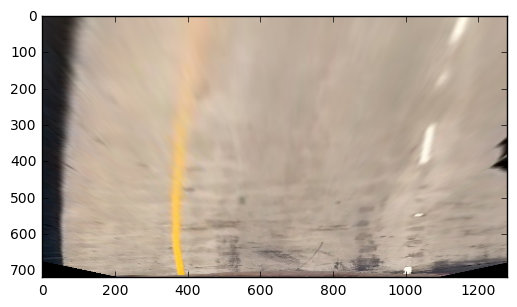
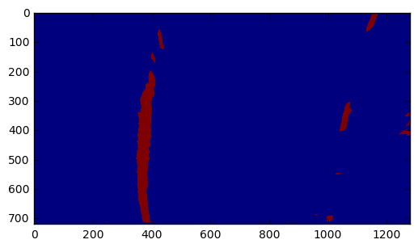
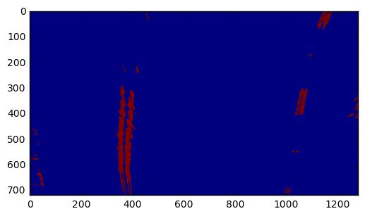
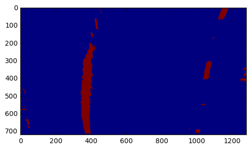
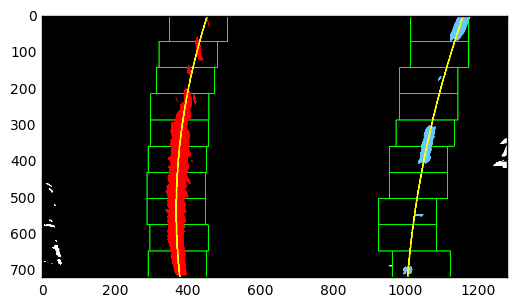

# Advanced-Lane-Lines-P4
### Udacity CarND-Advanced-Lane-Lines-Project

The goals / steps of this project are the following:
* Compute the camera calibration matrix and distortion coefficients given a set of chessboard images.
* Apply a distortion correction to raw images.
* Use color transforms, gradients, etc., to create a thresholded binary image.
* Apply a perspective transform to rectify binary image ("birds-eye view").
* Detect lane pixels and fit to find the lane boundary.
* Determine the curvature of the lane and vehicle position with respect to center.
* Warp the detected lane boundaries back onto the original image.
* Output visual display of the lane boundaries and numerical estimation of lane curvature and vehicle position.

### Camera Calibration

Using the calibration images (can be found in camera_cal/), and cv2, here's how we can calibrate the camera:

* convert the image to gray
* use *cv2* and *findChessboardCorners* to find the corners of the chess board (nx and ny are the expected number of corners)
```python
ret, corners = cv2.findChessboardCorners(gray, (nx, ny), None)
```
* accumulate results of multiple calibration images and then apply
```python
cv2.calibrateCamera(objpoints, imgpoints, img_size, None, None)
```
* finally, we can use undistort with the calibration results:
```python
cv2.undistort(image, mtx, dist, None, mtx)
```

Example of a calibration image and the resulting un-distortion acheived using the calibration results: 


And an example of test image and the resulting un-distortion:


### Perspective transform

Next we will apply perspective transform, so we can focus on the relevant part of the image, this can be done with cv2:

```python
src =  np.float32([[250,700],[1200,700],[550,450],[750,450]])
dst = np.float32([[250,700],[1200,700],[300,50],[1000,50]])

transform = cv2.getPerspectiveTransform(src, dst)
cv2.warpPerspective(image, transform, (w, h))
```

And here's an example of what it looks like after transforming:


### Pipeline
#### Applying yellow and white thresholds on HSV scale of the image
Using the HSV scale and a range filter, we will try and find white or yellow lanes:

```python
def filter_white_and_yellow(image):
    HSV = cv2.cvtColor(image, cv2.COLOR_RGB2HSV)

    yellow = range_threshold(HSV, yellow_threshold[0], yellow_threshold[1])
    white = range_threshold(HSV, white_threshold[0], white_threshold[1])
    return cv2.bitwise_or(yellow, white)
```

And here's the result of this filter applied on a test image:


#### Applying Sobel on the image
This method applies the Sobel algorithm on the x axis of image. 


```python
HLS = cv2.cvtColor(image, cv2.COLOR_RGB2HLS)
S = HLS[:,:,2]

sobel = cv2.Sobel(S, cv2.CV_64F, 1, 0, ksize=13)
```

And here's the result of this filter applied on a test image:


#### Combining white and yellow filtering and Sobel 
Combining the above filters, we get the following result:


### Finding lanes
Using the above combined filter that we will treat as a binary image, we will use a silding windows algorithm to estimate the lanes and try to fit them to a second degree polynomial.

Here's a visualization of how the algorithm works:


There's an alternative implementation that uses the previous fit (i.e. previously found lanes) as a starting point for where to look for the current fit (useful in a continuous real-world scenarios).

### Finding lane curvature and distance from lane center
Converting screen pixels to real-world size, we can calculate the lane curvature and the cameras distance from lane center.

The code for the calculations as well as the code for augmenting the original image with the data is in the [accompanying notebook](Advanced-Lane-Lines.ipynb) (cells 16-20).

Here's an example result:


### Pipeline results
Here are the pipeline results on the test images:


### Video pipeline results
Here's the *[project_video_output](project_video_output.mp4)* result of the project-video.

### Discussion 
This project is a good proof of concept for finding lanes, but it is limited in real world scenarios. Some of the mechanics in the pipeline (like the calibration) are very useful and pretty stable. However, there were many assumptions made in other parts of the pipeline, for example, the pipeine can be easily fooled by lighting, road conditions, and many more elements in any or all parts of the pipeline. The sliding windows algorithm and the polyfit need to be restricted (as to not provide unacceptable results) for the algorithm to work. 
But this is great foundation to start with and build (and improve) upon!